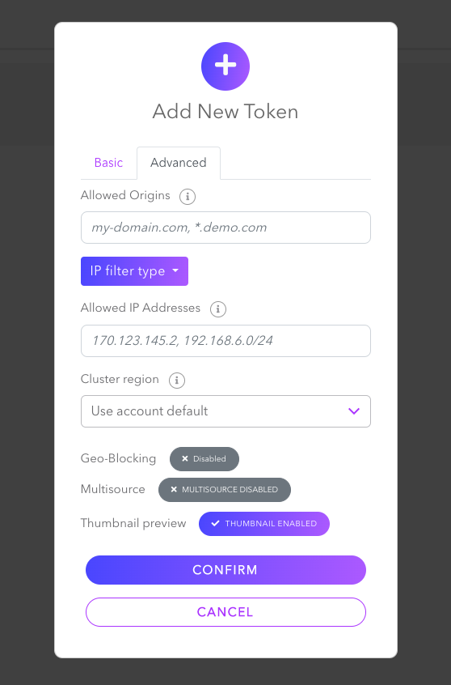
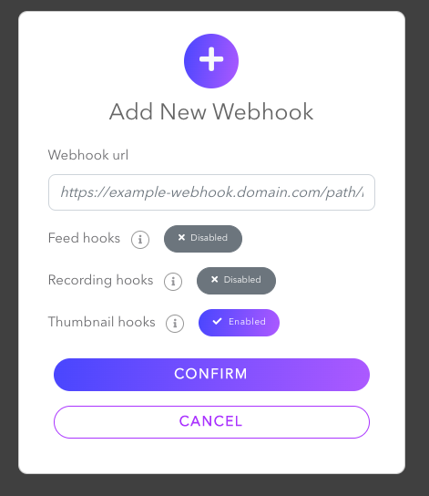

# Use Webhooks to Receive the Generated Thumbnails of the Ongoing Stream
This repository includes two different sample code folders about how to receive and store generated thumbnail images from the ongoing stream. After you create a webhook on Dolby.io either using Dashboard or API, you can set the Webhook URL depending on your choice. 
- To create a token on your Dashboard go to https://streaming.dolby.io/#/tokens  and click `Create` button. After you set the Basic settings, you need to enable `Thumbnail Preview` from Advanced settings.

- To create a webhook on your Dashboard go to https://streaming.dolby.io/#/webhooks and click `Create` button. You need to enable `Thumbnail hooks` and add your Webhook URL you either obtained using localhost with ngrok or an AWS service.

1. To store images locally, you can use your localhost address or ngrok.io to proxy the traffic to your local machine. It will give you a public facing URL for some amount of time and re-direct any traffic to that URL to your local machine. You can find how you can set it up in the README.md under the [folder](./store-thumbnails-locally/) containing the sample code.
2. To store images in an AWS S3 bucket using Lambda Function URL, navigate to [this folder](./blog-aws-lambda-function-url/). There's a detailed [blog post](https://confluence.dolby.net/kb/display/DOLBYIO/Store+Thumbnails+from+Your+Live+Stream+Using+AWS+Lambda+and+S3) about how you can set it up.