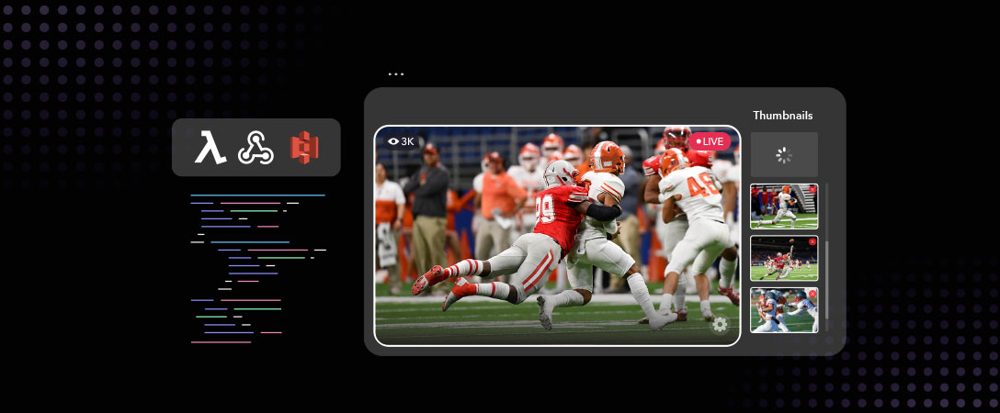
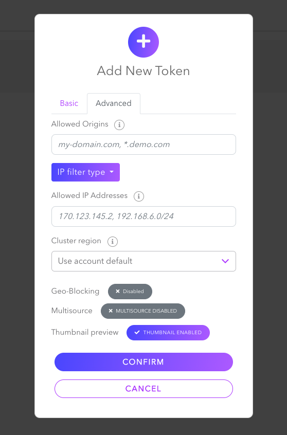
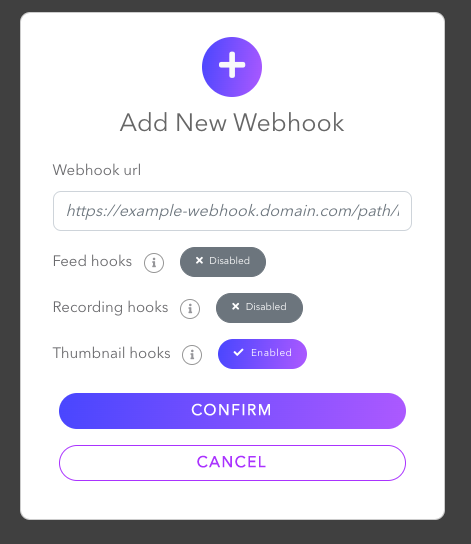

# Use Webhooks to Receive the Generated Thumbnails of the Ongoing Stream

This repository includes three different sample code directories about how to receive and store generated thumbnail images from the ongoing stream. After you create a webhook on Dolby.io either using Dashboard or API, you can set the Webhook URL depending on your choice. 
- To create a token on your Dashboard go to https://streaming.dolby.io/#/tokens  and click `Create` button. After you set the Basic settings, you need to enable `Thumbnail Preview` from Advanced settings.

- To create a webhook on your Dashboard go to https://streaming.dolby.io/#/webhooks and click `Create` button. You need to enable `Thumbnail hooks` and add your Webhook URL you either obtained using localhost with ngrok or an AWS service.

1. To store images locally, you can use your localhost address or ngrok.io to proxy the traffic to your local machine. It will give you a public facing URL for some amount of time and re-direct any traffic to that URL to your local machine. You can find how you can set it up in the README.md under the [store-thumbnails-locally directory](./store-thumbnails-locally/) containing the sample code.
2. To store images in an AWS S3 bucket using Lambda Function URL, navigate to [aws-lambda-function-url directory](./aws-lambda-function-url/). There's a detailed [blog post](https://dolby.io/blog/store-thumbnails-from-your-live-stream-using-aws-lambda-and-s3/) about how you can set it up.
3. Another option to use AWS is via SAM CLI. SAM CLI might be a better option if you want to develop bigger and more complex projects starting with a template. It allows you to edit the code from your editor and deploy it to Lambda, considering using the code editor in [AWS Web Lambda Console](https://docs.aws.amazon.com/lambda/latest/dg/foundation-console.html#code-editor) doesn't provide the flexibility to edit the packages bigger than 3 MB. Go to [aws-sam-thumbnails directory](./aws-sam-thumbnails/) to see how you can create a Lambda Function and an API Gateway to receive and store the thumbnails using AWS SAM.
