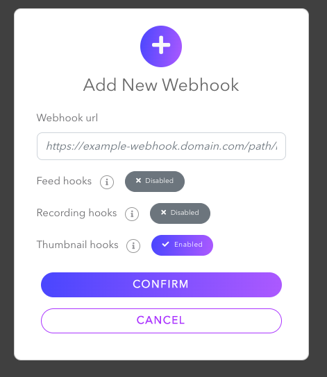

#  Using AWS SAM CLI to Set Up Lambda Function and API Gateway

The AWS SAM Command Line Interface (CLI) lets you locally build, test, and debug serverless applications defined by AWS SAM templates. The SAM CLI provides a Lambda-like execution environment locally and helps you catch issues upfront by providing parity between the actual Lambda execution environment.

**NOTE:** This folder contains the code you will implement, so you can apply the steps and configure your own SAM project by copying and changing the content in your SAM template project with the code in this folder.

#### **Step 0 - Install AWS SAM CLI**

Complete all [prerequisites](https://docs.aws.amazon.com/serverless-application-model/latest/developerguide/prerequisites.html) before moving forward with installing AWS SAM CLI. This includes:

1.  Signing up for an AWS account.

2.  Creating an administrative IAM user.

3.  Creating an access key ID and secret access key.

4.  Installing the AWS CLI.

5.  Configuring AWS credentials.

Then, follow [this](https://docs.aws.amazon.com/serverless-application-model/latest/developerguide/install-sam-cli.html) tutorial to install AWS SAM CLI. Then, create a [sample Hello World](https://docs.aws.amazon.com/serverless-application-model/latest/developerguide/serverless-getting-started-hello-world.html) application to start with a project template. Choose the options below to configure a project from the CLI.

 

After configuring your project, it will come with a *template.yaml* file that contains a Lambda function called *HelloWorldFunction* and an API event. Navigate through your project and open it in a code editor.

#### **Step 1- Edit the Lambda Function and Create an API Gateway**

We need to update the *template.yaml* with adding a new API and reference it under the API events.

Add this code block under your Resources:

```
MyApi:
    Type: AWS::Serverless::Api
    Properties:
      StageName: Prod
      BinaryMediaTypes:
      - image/jpeg
```
And, reference it under Events like this:


```
Events:
        HelloWorldApi:
          Type: Api
          Properties:
            RestApiId: !Ref MyApi
            Path: /hello
            Method: POST
```

Remove the *ApplicationResourceGroup* and *Outputs* part. Your *template.yaml* file should look like this at the end (Description part is same with how you specify your project's name during installation, so it may be different in your project):

```
AWSTemplateFormatVersion: '2010-09-09'
Transform: AWS::Serverless-2016-10-31
Description: >
  blog-aws-sam-thumbnails

  Sample SAM Template for blog-aws-sam-thumbnails

# More info about Globals: https://github.com/awslabs/serverless-application-model/blob/master/docs/globals.rst
Globals:
  Function:
    Timeout: 3

Resources:
  MyApi:
    Type: AWS::Serverless::Api
    Properties:
      StageName: Prod
      BinaryMediaTypes:
      - image/jpeg
  HelloWorldFunction:
    Type: AWS::Serverless::Function # More info about Function Resource: https://github.com/awslabs/serverless-application-model/blob/master/versions/2016-10-31.md#awsserverlessfunction
    Properties:
      CodeUri: hello-world/
      Handler: app.lambdaHandler
      Runtime: nodejs18.x
      Architectures:
        - x86_64
      Events:
        HelloWorldApi:
          Type: Api
          Properties:
            RestApiId: !Ref MyApi
            Path: /hello
            Method: POST
 ```

#### **Step 2 - Deploying the SAM project**

Let's test if we can successfully set up our Lambda Function and API Gateway. For the purpose of this walkthrough, we'll simply log the payload of the received event to the console and return a 200 status code back to the source to indicate a successful reception. In the next steps will implement the code to actually handle the call.

Go to *app.mjs* under *hello-world* folder and add a console.log(event). Your app.mjs should look like:

```
export const lambdaHandler = async (event, context) => {
    try {
        console.log(event)
        return {
            'statusCode': 200,
            'body': JSON.stringify({
                message: 'hello world',
            })
        }
    } catch (err) {
        console.log(err);
        return err;
    }
};

```

Then, go to root of your project (where *template.yaml* is available) and run ***sam build*** in your terminal. After you get  Build Succeeded notification, run ***sam deploy --guided*** Say yes(Y) to deployment wizard's prompts as shown below:


Once you get *Successfully created/updated stack ...* navigate through your API Gateway and Stages in your AWS Console and copy the "Invoke URL" in the "Prod" stage.


Now, you can use the "Invoke URL" as a webhook URL by adding the /hello Path to the end, as defined in your template.yaml when setting up the API gateway. So, for example, your webhook URL should be:

```https://23k6og5dc1.execute-api.us-west-1.amazonaws.com/Prod/hello```

#### **Step 3 - Set Up Dolby.io to Test the Webhook**
- To create a token on your Dashboard go to https://streaming.dolby.io/#/tokens  and click `Create` button. After you set the Basic settings, you need to enable `Thumbnail Preview` from Advanced settings.


- To create a webhook on your Dashboard go to https://streaming.dolby.io/#/webhooks and click `Create` button. You need to enable `Thumbnail hooks` and add the Webhook URL that you got from the previous step.



**Step 4 - Handling the Event and Storing the Thumbnails in an S3 Bucket**

After successfully seeing the log of the event in the "CloudWatch", we are now ready to implement the functionality to handle the event to compare signatures and upload the thumbnail image to the created S3 bucket.\
→ First, replace the entire *app.mjs* file in your project with the code in the [app.mjs file](./hello-world/app.mjs).

→ Then navigate through your *hello-world* folder directory --- the directory that contains the Lambda function --- and type ***npm install crypto util aws-sdk*** to install the packages that our code uses. Save your code and go back to the root directory of your project where the *template.yaml* exists.

→ Next, we need to create an S3 bucket. From your AWS Management Console search S3, from Buckets click *'Create Bucket'* and set a name for your bucket. 


(We used the name *blog-thumbnails-bucket* for the sample code in this repository.) 


Then, use services search bar for IAM, and go to *Policies* under IAM Dashboard. Click *Create Policy* and from Visiual editor choose a Service as *S3*. From Actions, choose *PutObject* to specify actions allowed in S3. And for Resources, click Add ARN(s) and enter the 'Bucket name' and select 'Any' for 'Object name' and click 'Add'. Select a name for your policy on the 'Review policy' part and click 'Create policy' button.  Lastly, from IAM Roles menu, find your Lambda function and from 'Add Permission' button, click 'Attach Policies' and find the policy you created and click 'Add Permissions'. 


→ Now, we need to add the WEBHOOK_SECRET as an environment variable to our Lambda function. Go to the [Dolby.io Dashboard](https://streaming.dolby.io/#/webhooks) and click to the webhook you created, copy the Webhook Secret. Navigate to the AWS Lambda Console Configuration menu and add an environment variable called WEBHOOK_SECRET. 


Before you deploy the project, go to your *samconfig.toml* and change the *'resolve_s3'* parameters (lines 23 and 32) to *'false'* in your project.

→ Now that we've set up an S3 bucket, updated our Lambda function code accordingly, and added the WEBHOOK_SECRET as an environment variable --- we are good to run ***sam build*** and ***sam deploy*** in our terminal.

#### **TEST TIME!!!**


Now, go back to your [Dolby.io](http://Dolby.io) dashboard and start a Broadcast. Then, navigate back to your lambda function's "CloudWatch logs". You should be receiving an event log every 30 seconds, and check your S3 bucket and view the logged image objects.

And, that's it! Now, you know how you can receive and store the thumbnail images of the ongoing stream.💪